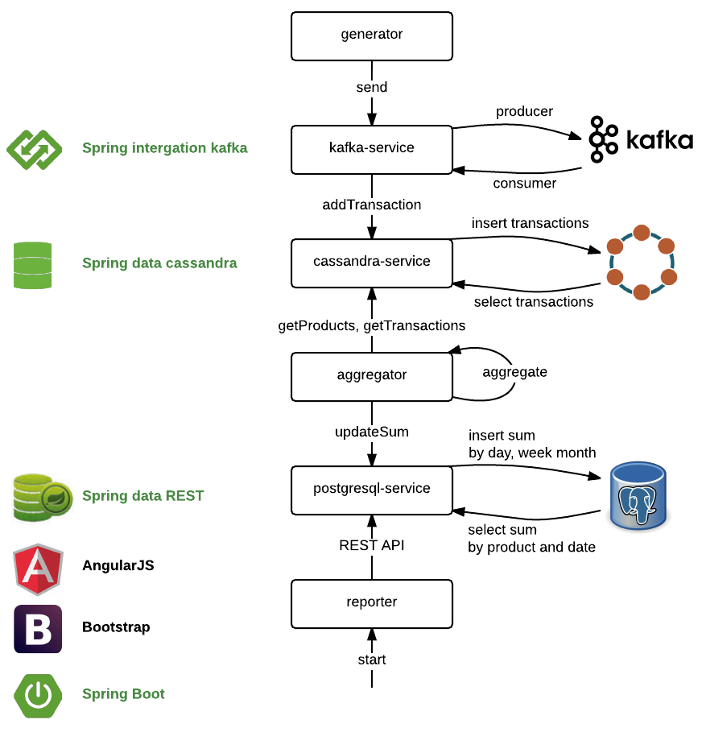
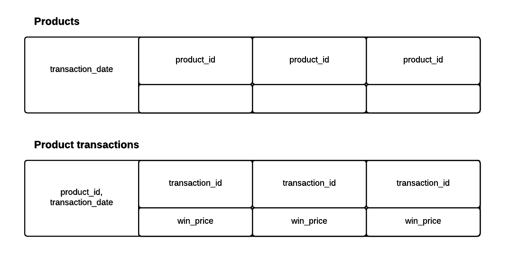
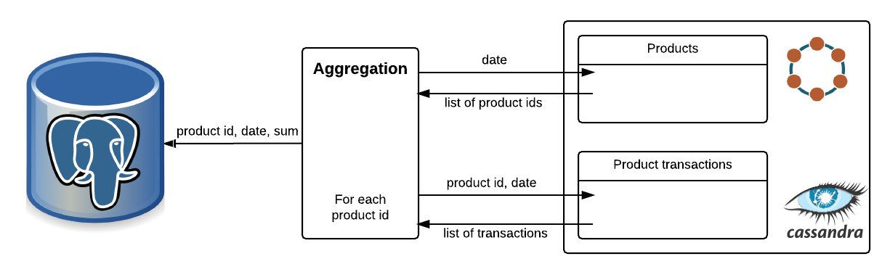
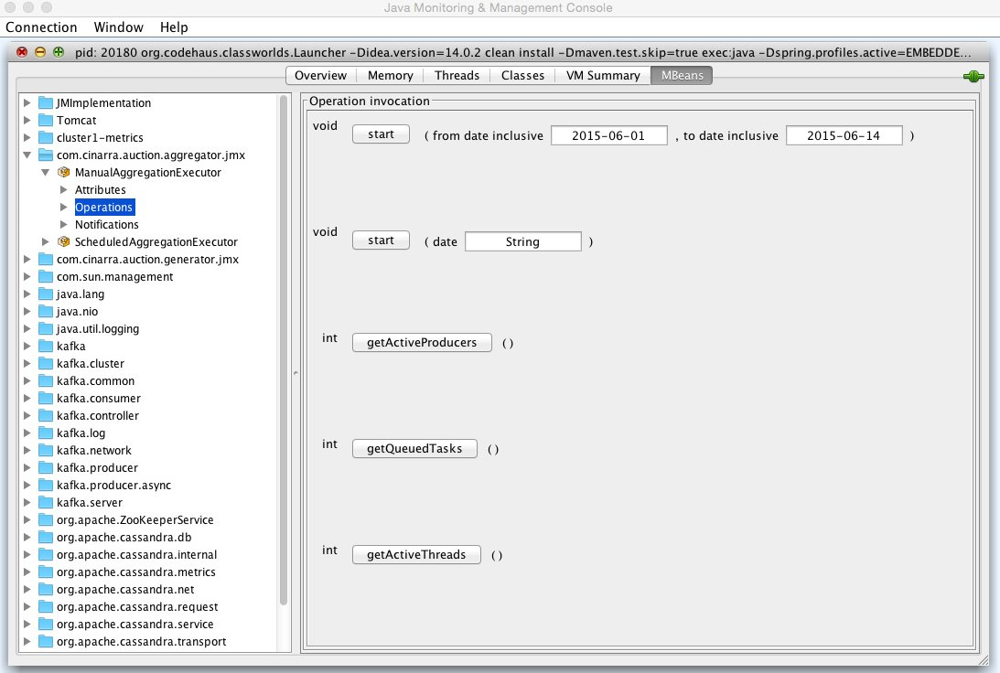
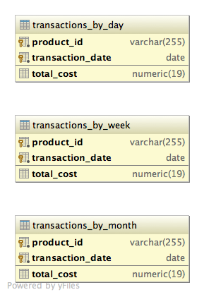
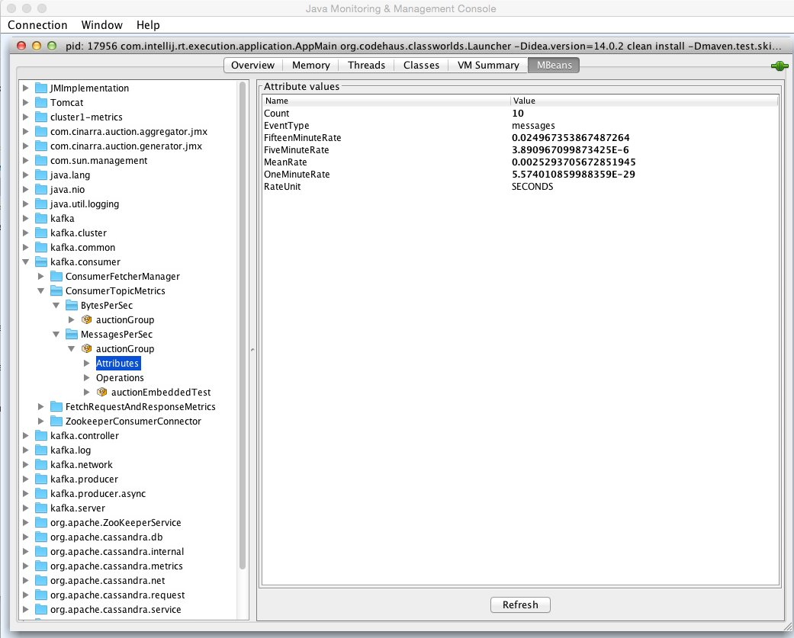
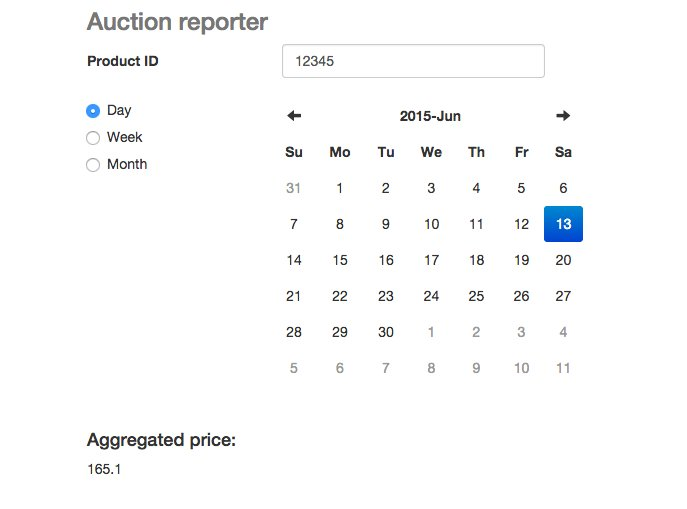
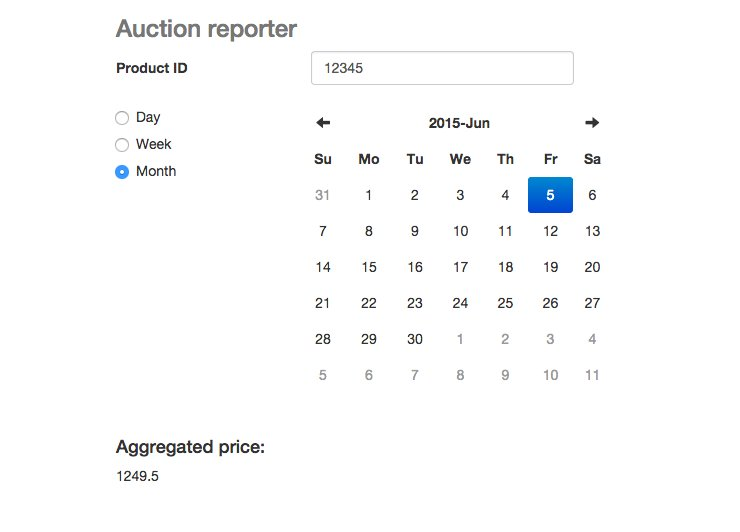
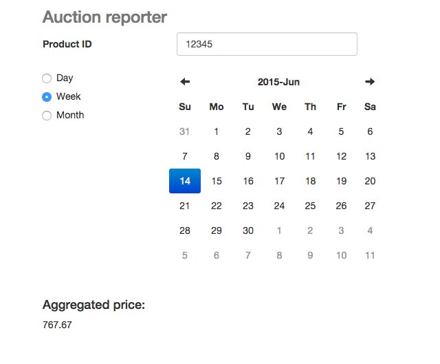

# README #

###Project Modules


####Technologies
The application is written using Spring framework. 
* Spring Boot project allows to get application up and running as quickly as possible. 
* Spring Integration to provide a simple model for building Kafka integration solution.
* Spring Data REST makes it easy to expose PostgreSQL repository as RESTful endpoints.
* Spring Data Cassandra offers a familiar interface to those who have used other Spring Data modules in the past.
JMX is used for monitoring purposes.
Bootstrap and AngularJS for Reporting module Web UI.

JUnit4, Mockito, cassandra-unit, hamcrest for testing.

###Generator
Generates micro-transactions in several concurrent threads. The number of threads and the number of transactions can be specified in property file. Negative value for transactions quantity means infinite number of transactions.
 
###Kafka
Integration with Kafka is implemented using Spring Integration. Spring Integration provides a number of benefits:
* usage of well known enterprise application patterns
* high-level abstraction over messaging implementation
* separation of concerns
* fine-grained reusable components for messaging
* wide selection of channels and gateways to communicate with external systems

###Cassandra data model


Products table stores ids of products sold in auction at a specific date.

From product_transactions table one can get all transactions made on particular date for a distinct product.

Aggregations are always done for a single date. Transaction date is used as a row key. This gives efficient access pattern due to minimal disk seeks. Product id is used as a column key. Each product id is stored only ones, even if there were multiple auctions for the same product during the day.

In product_transactions table row key consists of product id and transaction date. This gives efficient lookup to get transactions by product by date, as well as limits a number of records in a row by a number of auctions for a product a day. Using transaction id as a column key allows to prevent duplicates. If same transaction is delivered to Cassandra multiple times, it will just be updated.

###Aggregation


Each aggregation calculates total sum for a particular date from scratch. This allows to guarantee eventual consistency of the data, no matter in which order transactions were inserted to Cassandra.

Aggregations are performed in provided intervals of time for current date.

Additionally it is possible to provide an initial aggregation start date as an argument in a launch command. In this case the initial aggregation will be done for a period from start date till current date.

If the system was down and aggregations were not calculated properly, there is an opportunity to launch aggregation manually. Manual aggregator supports aggregation for a particular date or a date period, and can be launched using JMX.


 
###PostgreSQL data model


Aggregation results are stored in PostgreSQL in three different tables: by day, by week and by month. Precalculated sums make selections by week and by month work fast.

Primary key in all three tables consists of product id and transaction date. In tables transactions_by_week and transactions_by_month column transaction_date contains first day of week and month respectively.

No additional indexes needed. Standard btree index on columns used in primary key is enough for queries by product id and transaction date.

###Monitoring

JMX support is implemented for managing and monitoring application. Bellow is the list of some metrics and operations exported to JMX:

#####Generator
Generator metrics can be found in package *com.cinarra.auction.generator.jmx*

######GeneratorExecutor
   number of active producers
   number of active threads
   number of queued tasks
   total number of executed producers

######Producer threads:
   mean sending time
   number of messages sent
   start time
   thread state


#####Aggregator
Aggregator metrics can be found in package *com.cinarra.auction.aggregator.jmx*

######ManualAggregationExecutor
   number of active producers
   number of active threads
   number of queued tasks

   Methods for manual execution:
   start(String date)
   start(String startDate, String finishDate)

######ScheduledAggregationExecutor
   number of active producers
   number of active threads
   number of queued tasks

#####Cassandra
Cassandra metrics can be found in package *org.apache.cassandra.metrics/Keyspace/auction*

#####Kafka
Kafka metrics can be found in packages
*kafka.consumer*
*kafka.producer*



###Reporting

Web UI is written using Bootstrap. AngularJS is used for consuming REST API.





###Test scenario

There is an EMBEDDED profile for testing purpose. This profile enables execution of embedded Zookeeper, Kafka, Cassandra, HSQLDB and Tomcat.
Profile JMX enables export to JMX.

#####Aggregation functionality test scenario

There is a TEST_SCENARIO profile to enable aggregation functionality test scenario. In this test scenario generated the following stream of messages

transaction date    | product id | transaction id  | sum
--------------------|------------|-----------------|-------
2015-06-14 10:15:30 |      12345 |               1 | 123.11
2015-06-14 13:11:31 |      12345 |               2 | 456.23
2015-06-14 14:35:30 |      12345 |               3 | 23.23
2015-06-13 16:15:00 |      12345 |               4 | 66.77
2015-06-13 17:45:36 |      12345 |               5 | 98.33
2015-06-05 17:17:30 |      12345 |               6 | 49.65
2015-06-05 16:17:00 |      12345 |               7 | 254
2015-06-05 19:55:30 |      12345 |               8 | 89.98
2015-06-01 22:25:20 |      12345 |               9 | 54.76
2015-06-01 00:15:33 |      12345 |              10 | 33.44

Sum by day:

date         | sum
-------------|------
1 June 2015  | 88.20
5 June 2015  | 393.63
13 June 2015 | 165.10
14 June 2015 | 602.57

Sum by week:

date           |  sum
---------------|------
1-7 June 2015  | 481.83
8-14 June 2015 | 767.67

Sum by month:

date      | sum
----------|------
June 2015 | 1249.5

To get aggregation results it is needed to provide product id = 12345, to choose aggregation period (day/week/month) and date. For periods "week" and "month" that's enough to chose any date from that period.

######Maven command to build and run the aggregator functionality test scenario:
From project root directory:

```bash
mvn clean install && cd reporter && mvn spring-boot:run -Dspring.profiles.active=EMBEDDED,JMX,TEST_SCENARIO
```

[Reporter Web UI](http://localhost:8080/)


#####Load testing scenario
There is LOAD profile to enable load test scenario.

Generates provided number of random transactions (by default infinite number) for current date and product id in interval [0, 1000).
Aggregation is executed with provided rate (by default 20 seconds)


######Maven command to build and run the aggregator functionality test scenario
From project root directory:

```bash
mvn clean install && cd reporter && mvn spring-boot:run -Dspring.profiles.active=EMBEDDED,JMX,LOAD
```

[Reporter Web UI](http://localhost:8080/)

[REST aggregation results by day](http://localhost:8080/day)
